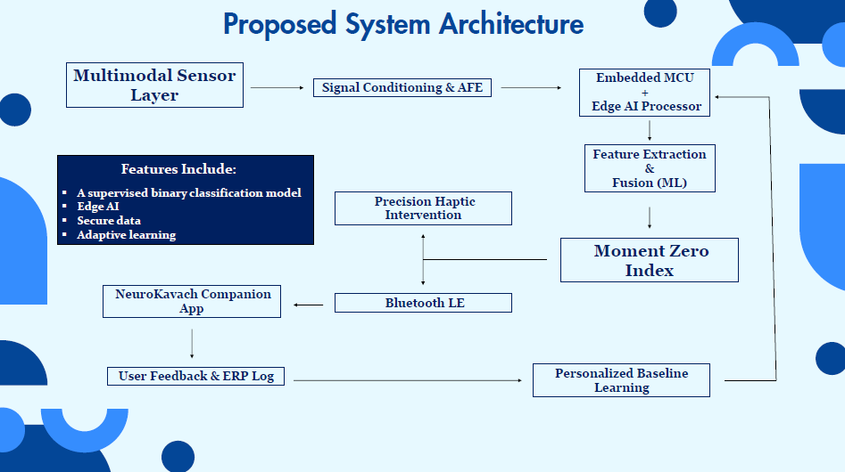
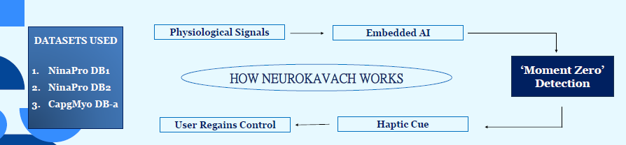

<h1 align="center">NeuroKavach</h1>

AI-assisted wearable concept for early intervention during <b>Obsessive-Compulsive Disorder (OCD)</b> episodes using multimodal physiological sensing, embedded AI, and real-time haptic feedback.

🥈 <b>Runner-Up (2nd Place) – Idea Manthan Ideathon</b>

---

# Demonstration

### 🌐 Live Demo Website

**https://neurokavach-1.onrender.com/dashboard**

### 🎥 Proof of Concept Video

**https://drive.google.com/file/d/1yA4UbeEAseOrR9dZpwNQwavNxBQWztA7/view?usp=sharing**

> **Note:** The demonstration represents an early proof of concept created for the ideathon. It illustrates the proposed workflow and user experience rather than a clinically validated medical device.

---

# Website Preview

## Dashboard

## System Architecture

## Proposed Workflow

---

# Overview

NeuroKavach is an engineering concept exploring how wearable technology and embedded artificial intelligence can assist individuals experiencing **Obsessive-Compulsive Disorder (OCD)**.

The project proposes detecting the earliest physiological indicators of a compulsive episode—referred to as **Moment Zero**—using wearable sensing and lightweight Edge AI. Once detected, the system delivers immediate, non-invasive haptic feedback to help users regain awareness before compulsive behaviour escalates.

Rather than replacing therapy, NeuroKavach is envisioned as a digital therapeutic companion that complements evidence-based interventions such as **Exposure and Response Prevention (ERP).**

---

# Project Status

**Current Stage:** Concept & Early Proof of Concept

This repository contains:

- Project website
- Design documentation
- Ideathon presentation
- Proof-of-concept demonstration
- Research references
- System architecture
- Development roadmap

This project is **not yet a complete hardware or software implementation.**

Hardware development, embedded firmware, AI model optimisation, and clinical validation remain future work.

---

# The Problem

Obsessive-Compulsive Disorder (OCD) affects millions of people worldwide and is characterised by intrusive thoughts followed by repetitive compulsive behaviours.

Although **Exposure and Response Prevention (ERP)** remains the gold-standard treatment, one major challenge persists:

> During the earliest phase of a compulsive urge, anxiety rises rapidly, making it increasingly difficult for individuals to consciously apply coping strategies.

NeuroKavach explores whether wearable physiological sensing and Edge AI can identify this critical intervention window—**Moment Zero**—and provide immediate, non-invasive support.

---

# Proposed Workflow

---

# Proposed Features

- Multimodal physiological sensing
- Edge AI inference
- Personalised baseline learning
- Real-time haptic intervention
- Companion mobile application
- Human-in-the-loop feedback
- ERP support
- Bluetooth Low Energy connectivity

---

# Technology Exploration

The concept investigates the integration of:

- Embedded Systems
- Artificial Intelligence
- Machine Learning
- Signal Processing
- Wearable Computing
- Edge Computing
- Bluetooth Low Energy
- Human-Centered Design
- Digital Mental Health

---

# Website

This repository also hosts the demonstration website developed to communicate the NeuroKavach concept.

### Built With

- Python
- Flask
- HTML5
- CSS
- JavaScript

---

# Development Roadmap

| Phase | Status |
|---------|:------:|
| Concept Development | ✅ |
| Literature Review | ✅ |
| System Architecture | ✅ |
| Website Development | ✅ |
| Proof of Concept | ✅ |
| Embedded Prototype | 🔄 Planned |
| Wearable Sensor Integration | 🔄 Planned |
| Edge AI Deployment | 🔄 Planned |
| Companion Mobile Application | 🔄 Planned |
| User Testing | 🔄 Planned |
| Clinical Collaboration | 🔄 Planned |

---

# My Contributions

- Conceived the NeuroKavach solution concept.
- Researched wearable intervention strategies for OCD.
- Designed the overall system workflow.
- Contributed to the technical presentation and ideathon pitch.
- Coordinated project documentation and repository structure.

---

# Team

**Team ZeroStack**

- [Tirtharaj Bhattacharya](https://github.com/rascal46)
- [Samrat Sinha](https://github.com/Samrat648)
- [Sudipto Mondal](https://github.com/sudipto-mondal-05)

---

# Acknowledgements

This project was inspired by ongoing research in:

- Wearable Healthcare
- Embedded Artificial Intelligence
- Digital Therapeutics
- Just-in-Time Interventions (JITIs)
- Human-Centred Computing

We gratefully acknowledge the publicly available research literature and datasets that informed the conceptual development of NeuroKavach.

---

# Disclaimer

NeuroKavach is an educational and research-oriented engineering concept.

It is **not** a medical device and is **not intended to diagnose, treat, cure, or prevent any medical condition**.

The repository documents an ideation-stage project and should not be interpreted as clinical advice or a validated healthcare solution.

---

# Copyright

© 2026 Team ZeroStack.

All Rights Reserved.

The documentation, visual assets, concept descriptions, project website, and original project materials contained in this repository may not be reproduced, redistributed, or used to create derivative works without prior written permission from the authors.
